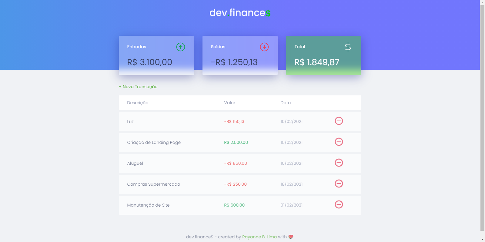

<h1 align="center">
    
</h1>
 

  

## 🚀 Tecnologias

- [HTML](#)
- [CSS](#)
- [JavaScript](#)

## 💻 Demo

Acesse a demo do site através deste link:

* [Clique aqui]("http://rayanneblima.github.io/dev-finance/")
## 💻 Projeto

Facilitando a sua vida financeira 💰

* Este é um projeto desenvolvido durante a **[MaratonaDiscover](https://maratonadiscover.rocketseat.com.br/)**, realizada pela **[@Rocketseat](https://github.com/Rocketseat)**.

## 🔖 Layout

Você pode visualizar o layout do projeto através do link abaixo:

- [Layout](https://www.figma.com/file/JEfgGN7089jLXga5T9hBXt/dev.finance-Maratona-Discover-Copy) 

Lembrando que você precisa ter uma conta no [Figma](http://figma.com/) para acessá-lo.

## 📝 Licença

Esse projeto está sob a licença MIT. Veja o arquivo [LICENSE](LICENSE.md) para mais detalhes.

---

Desenvolvido com 💖 por Rayanne B. Lima

